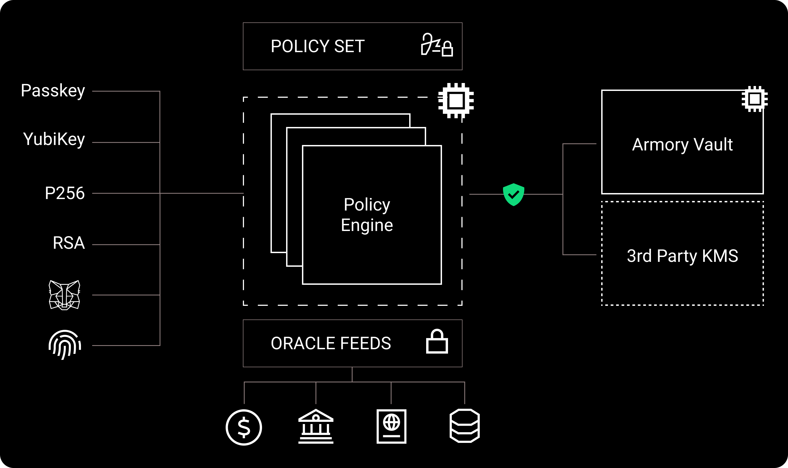

<p align="center">
  <a href="https://www.narval.xyz/" target="blank"></a>
</p>
<p align="center">Secure, advanced, and flexible access management stack for web3.</p>
<p align="center"><a href="https://www.narval.xyz/?utm_source=github&utm_medium=repository" target="_blank">🌐 Website</a> • <a href="https://docs.narval.xyz/?utm_source=github&utm_medium=repository" target="_blank">📚 Documentation</a></p>
<p align="center"><a href="https://github.com/narval-xyz/narval/actions/workflows/armory.yml" target="_blank"></a> <a href="https://github.com/narval-xyz/narval/actions/workflows/policy-engine.yml" target="_blank"></a> <a href="https://github.com/narval-xyz/armory/actions/workflows/vault.yml" target="_blank"></a> <a href="https://github.com/narval-xyz/armory/actions/workflows/packages.yml" target="_blank"></a></p>

## What's the Armory?

The Armory Stack is an open-source access management system tailored for
uses-case that need strong authentication and fine-grained authorization. It is
designed to secure the usage of private keys, wallets, and web3 applications.

It's a web3-native policy engine combined with a highly customizable next-gen
auth system, able to be deployed in a variety of secure configurations.



## Requirements

Node.js 21+

Docker

OPA CLI (if not running in Docker) [link](https://www.openpolicyagent.org/docs/latest/#running-opa)

## Getting started

To setup the project, run the following command:

```bash
git clone git@github.com:narval-xyz/narval.git
cd narval
make setup
```

At the end, you must have a working environment ready to run any application.

Alternatively, if you want to set up each application individually, you can
check [Armory](./apps/armory/README.md), [Policy
Engine](./apps/policy-engine/README.md), and [Vault](./apps/vault/README.md)
"Getting started" sections.

## Docker

We use Docker & `docker-compose` to run the application's dependencies.

```bash
make docker/up
make docker/stop
```

Alternatively, you can run the entire development stack in Docker containers.

> [!IMPORTANT]
> This builds a local dev image that mounts your filesystem into the container. Only db schema, dependency, or config changes require re-building. Do not use this build for production.

```bash
# Build the application's image.
make docker/stack/build

make docker/stack/up
make docker/stop
```

## Testing

To run tests across all existing projects, you can use the following commands:

```bash
# Run all tests
make test

make test/type
make test/unit
make test/integration
make test/e2e
```

These commands utilize the NX CLI's run-many feature to execute the specified
targets (test or test:type) across all projects in the monorepo.

## Formatting

We use [Prettier](https://prettier.io/) and [ESLint](https://eslint.org/) to
ensure code consistency. You can run the following commands to format and lint
the whole code base.

```bash
# Format and lint all the code.
make format
make lint

# Check for formatting and linting errors without fixing them.
make format/check
make lint/check
```

## NPM

The `.npmrc` file is needed to access a private registry for the optional
dependency `@narval-xyz/armory-mpc-module`.

> [!IMPORTANT]
> This file is NOT in git, but it's necessary for the build if you're using MPC
> to sign decisions in the Policy Engine.

1. Create a `.npmrc` file in the root of this project.
1. Get the values from someone who has them.
1. Now `make install` should work.

## Generating a new project

NX provides two types of projects: applications and libraries. Run the commands
below to generate a project of your choice.

```bash
# Generate an standard JavaScript library.
npx nx g @nrwl/js:lib
# Generate an NestJS library.
npx nx g @nx/nest:library
# Generate an NestJS application.
npx nx g @nx/nest:application --tags type:application
```

For more information about code generation, please refer to the [NX
documentation](https://nx.dev/nx-api/nx).

## Publishing packages

This section describes the process to release a new version of publishable
packages to NPM.

1. Run `make packages/release` and follow the prompts to bump the
   projects' versions.
1. Run `make install` to update `package-lock.json`.
1. Commit and push the changes to your branch.
1. After your branch is merged, manually trigger the [packages pipeline to
   publish](https://github.com/narval-xyz/armory/actions/workflows/packages-publish.yml)
   the new version to NPM.

You can find the publishable packages listed in the `release.projects` value in
the `nx.json`.

## OpenTelemetry

The Armory Stack uses [OpenTelemetry](https://opentelemetry.io/docs/) (OTEL)
for observability through traces and metrics.

For details on how OTEL is instrumented, head over
[@narval/open-telemetry](./packages/open-telemetry/).

### Setup

1. Start local dependencies:

```bash
make docker/otel/up
```

2. Set environment variables:

```bash
OTEL_SDK_DISABLED=false
OTEL_EXPORTER_OTLP_ENDPOINT=http://localhost:4318
```

> [!NOTE]
> OTEL is disabled by default in development.

3. Restart the application.

4. Access Jaeger UI: http://localhost:16686

### Naming Conventions

- Traces: `operation.entity.action` (e.g., `policyStore.policies.update`)
- Metrics: `system_entity_unit_state` (e.g., `policy_store_updates_total`)

See [Metric Naming](./packages/nestjs-shared/src/lib/module/open-telemetry/service/metric.service.ts)
and [Trace/Span
Name](./packages/nestjs-shared/src/lib/module/open-telemetry/service/trace.service.ts)
adopted conventions.

### Debugging

If you want to debug traces, the best way is to run `make docker/otel/up` and
check the Jaeger UI at http://localhost:16686.

In contrast, if you want to debug application instrumentation, open the `.env`
file and set `OTEL_LOG_LEVEL=debug` to have a better view of what the SDK is
doing.

## Troubleshooting

### DB URL in env variable fails when using `docker run`, but works when running outside docker

If using `docker run --env-file .env ...`, the env file cannot include quotes
around values. The quotes will be included in the value.

### `localhost` PSQL URL cannot connect

Inside docker, `localhost` points to the container not your computer (host).
Change `localhost` to `host.docker.internal` to reference to the host IP
address in the local network.

## License

Armory is [MPL 2.0 licensed](./LICENSE).

You can find an exhaustive list of licenses of third-party software
dependencies used by the Armory at
[LICENSES_DISCLOSURE.md](./LICENSES_DISCLOSURE.md).

> To generate the list, run `./tools/licenses-disclosure/main.sh >
LICENSES_DISCLOSURE.md`.
