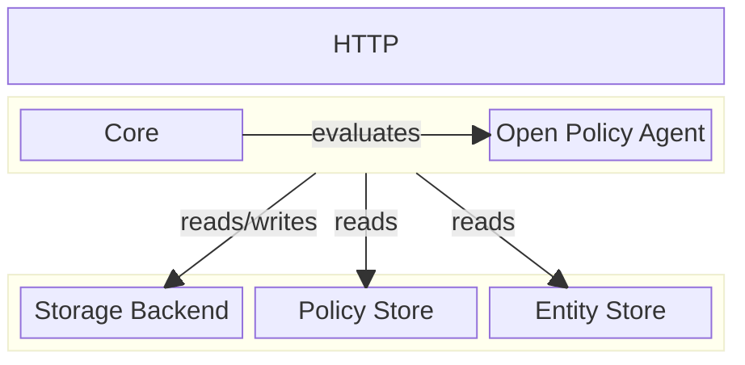

# Policy Engine Architecture

This document describes the high-level architecture of the policy engine.

The policy engine is built on the shoulders of the Open Policy Agent (OPA), a
battle-tested multi purpose engine trusted by many organizations. The OPA core
bunlded with the policy engine's artifact and it's considered a trusted
component.

The policy engine layer, is responsible for encrypting and decrypting client
data it stores. When the engine server starts, it writes data to its storage
backend. Since the storage backend lives outside the engine, it's considered
untrusted so the engine will encrypt the data before it sends them to the
storage. This mechanism ensures that if a malicious attacker attempts to gain
access to the storage backend, the data cannot be compromised since it remains
encrypted, until the engine decrypts it. The storage backend must provide a
durable data persistence where data is secured and available across the engine's
instances.

Similar to the storage backend, the policy store and the entity store also live
outside and are considered untrusted. The key difference is that the engine
never writes to these stores, it only reads from them. The data in these stores
are hashed and signed by the client's private key. The engine uses the client's
public key to verify the signature and hash. This mechanism ensures that the
data is authentic and has not been tampered with.
