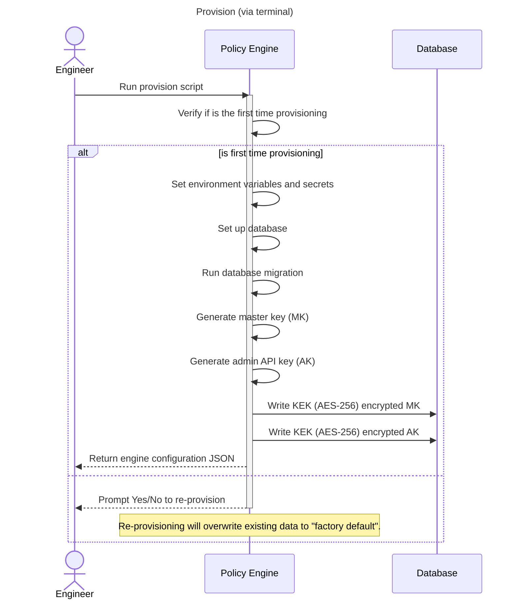
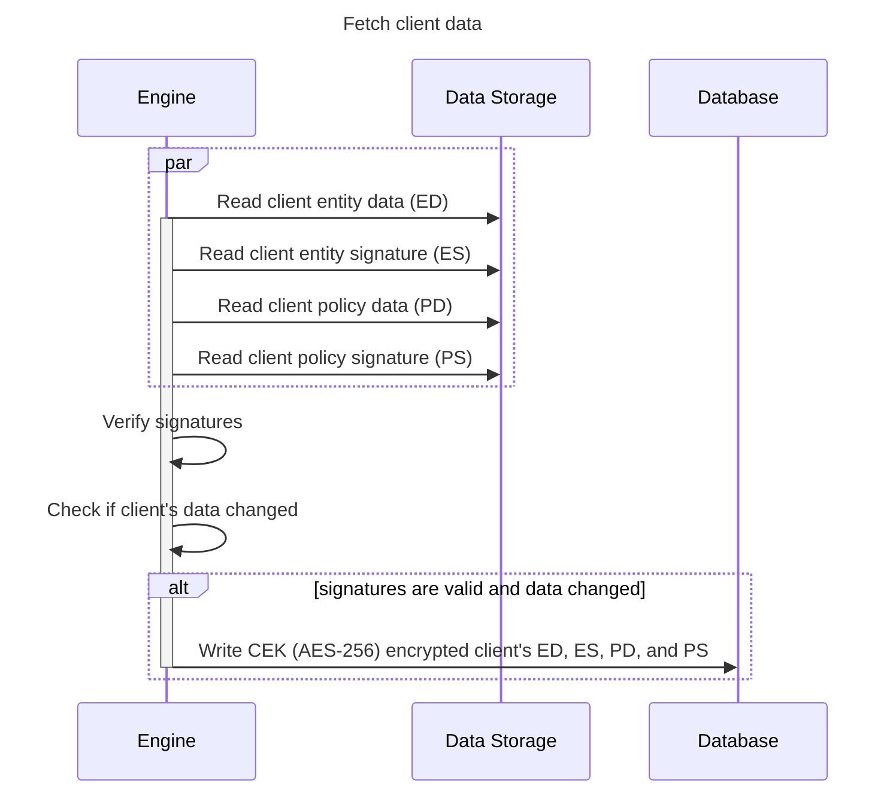
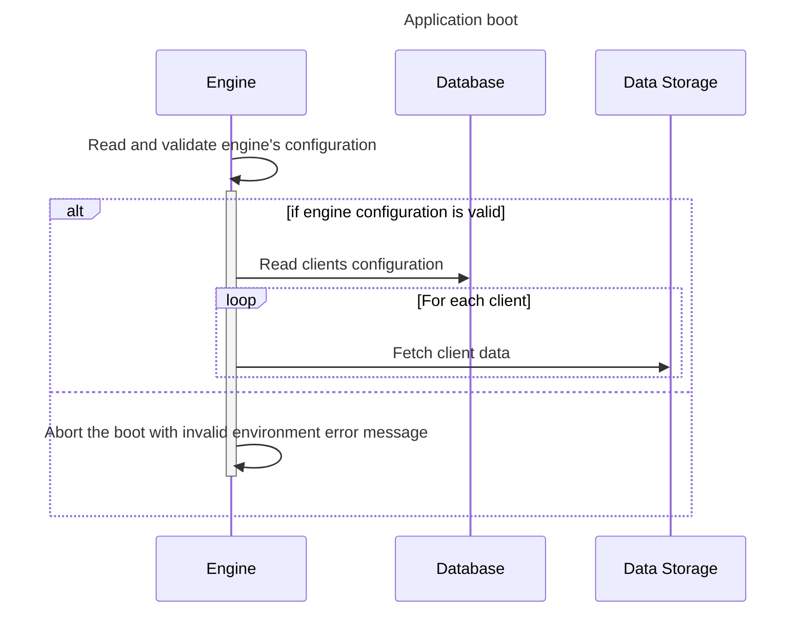
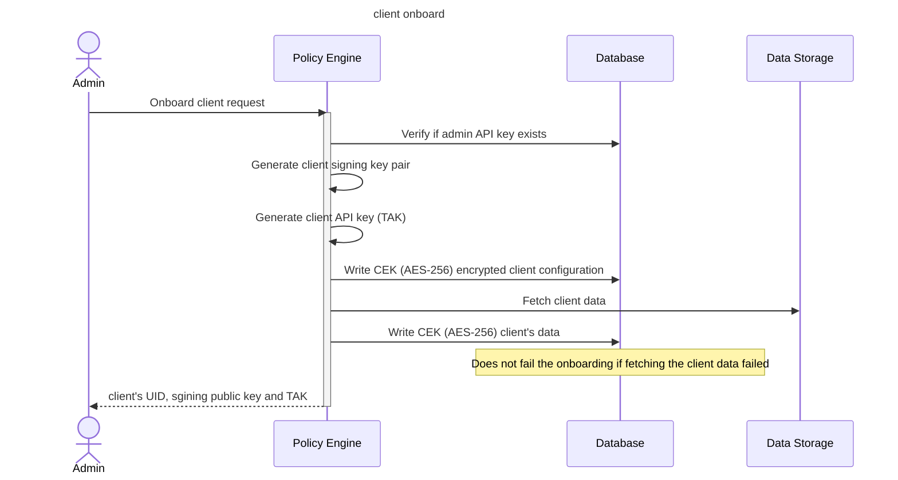
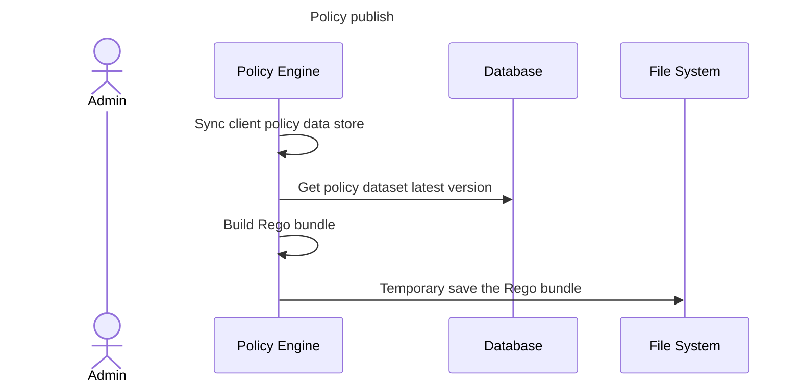

# Policy Engine Setup

## Terminology

- **CEK**: Content Encryption Key. The key used to encrypt client-related data.
- **KEK**: Key Encryption Key. The key used to encrypt engine-related data.
- **MK**: Master Key
- **Data Storage**: The storage system responsible for holding data related to
  clients entities and policies. While Narval doesn't mandate the use of a
  specific storage system like S3 or IPFS, it does require that the data stored
  conforms to Narval's data structure for entities and policies.
- **Database**: The engine's database. It's used to store some of engine's
  configuration, client's encrypted configuration, and encrypted client's data.
- **Engineer**: A persona with high credentials to set up critical software within
  an organization.
- **Admin**: A persona responsible for managing the engine in the organization.
  It can be the same person as the Engineer.

## Provision

Summary of the provision procedure.

## Sync client data stores

Summary of the procedure to fetch client data. This is used at boot time and
when a new client is onboarded.

- To verify if data changed, we compare the stored hashes with the received ones.

## Boot

Summary of the boot procedure.

## Client onboard

Summary of the procedure to onboard a new client in a live policy engine.

- **Onboard client Request**: Requires: Admin API key, client ID, Entity storage
  URL, Entity signature URL, Entity JWKS, Policy storage URL, Policy signature
  URL, Policy JWKS.
- **Content Encryption Key (CEK)**: A unique key made by blending a Master Key
  and a client UID with a process called HMAC Key Derivation Function (HKDF), used
  to encrypt data.
- **Admin Role**: Only an admin can add new clients to the system.
- **Admin API Keys**: The system supports multiple API keys for admins, allowing
  several admins to operate.
- **client's Signing Key**: This key signs evaluation responses, ensuring
  they're genuine and allowing verification by upstream services.
- **client API Key**: Used by clients to authenticate their requests to the
  Policy Engine, ensuring that the requests are legitimate. It's used alongside
  user signed requests.

## Policy publish

## Encryption

This section describes the encryption summary used to secure the Policy Engine.

1. **Master Password to Key Encryption Key (KEK) via PBKDF2**: Using PBKDF2
   (Password-Based Key Derivation Function 2) to derive a Key Encryption Key (KEK)
   from an "encryptor master password" is a standard practice. PBKDF2 is designed
   to make brute-force attacks difficult by using a salt and iterating the hashing
   process many times, thus slowing down the attack attempts.
   1. [node.js crypto built-in implementation](https://nodejs.org/api/crypto.html#cryptopbkdf2password-salt-iterations-keylen-digest-callback)
   2. Master Password is an env secret
2. **Generating an AES-256 Master Key and Encrypting with KEK**: Generating a
   strong AES-256 master key for encryption is a solid choice given AES-256's
   widespread acceptance and strength. Encrypting this master key with the KEK for
   storage is a common approach in hierarchical key management systems, ensuring
   that the master key is not exposed in plaintext.
3. **Deriving a Content Encryption Key (CEK) from the Master Key using HKDF**:
   HKDF (HMAC-based Key Derivation Function) is designed for deriving additional
   keys from a single master key, which is a suitable method for generating Content
   Encryption Keys (CEKs) from your master key. This step allows for different keys
   to be used for different pieces of content or sessions, enhancing security by
   limiting the scope of each key's usage.
   1. [node.js crypto built-in implementation](https://nodejs.org/api/crypto.html#cryptohkdfdigest-ikm-salt-info-keylen-callback)

### Notes

- **Secure Handling of Salts, IVs, and Nonces**: Ensure that salts for PBKDF2,
  Initialization Vectors (IVs) for AES encryption, and nonces for HKDF (if
  applicable) are securely generated (cryptographically secure random values) and
  handled properly. Salts and IVs don't need to be kept secret but should be
  unique to prevent various cryptographic attacks.

### AWS KMS encryption

In AWS KMS, the KMS Customer Master Key (CMK) replaces the MK, and then the
derived Data Keys replace the CEK. There is no need for a Master Password or KEK
because the CEK is generated & used within an HSM.

KMS key policies are used to restrict the CMK to the specific EC2 instance. If
using Nitro Enclaves, the CMK Key Policy can be set to match a specific
enclave’s attestation, effectively locking usage of that key to a single
enclave.
